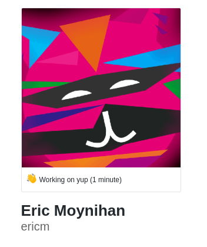
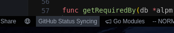

# 

 Visual Studio Code Github Status Presence

An extension that will sync your current workspace name and time spent on it to your GitHub status

## Features

The extension will read your current workspace as well as how long it's been open and sync it your GitHub profile like so:

The extension will post to GitHub every X amount of minutes (configurable in settings, default is 5). **It will also set the expirey time of the status to the interval time so it will be cleared after the workspace is closed.**

It provides a status icon which can be clicked to enable/disable the extension for the current session (or you cna blacklist it's path in settings):

The emoji is also configurable :0

## Setting it up

If no GitHub token is found, it will ask for one. It will direct you to the tokens page where you will make one and paste it into the input box. Just ensure you have the folloing token permission set:

![[users]](./assets/3.png)

## Extension Settings

This extension contributes the following settings:

- `githubstatus.token`: GitHub User Access Token
- `githubstatus.interval`: Refresh interval / Expirey time for GitHub Status (in minutes)
- `githubstatus.blacklist`: Blacklist of workspace paths that wont be synced
- `githubstatus.emoji`: Emoji used for status. See [this gist](https://gist.github.com/rxaviers/7360908) for full list of options
